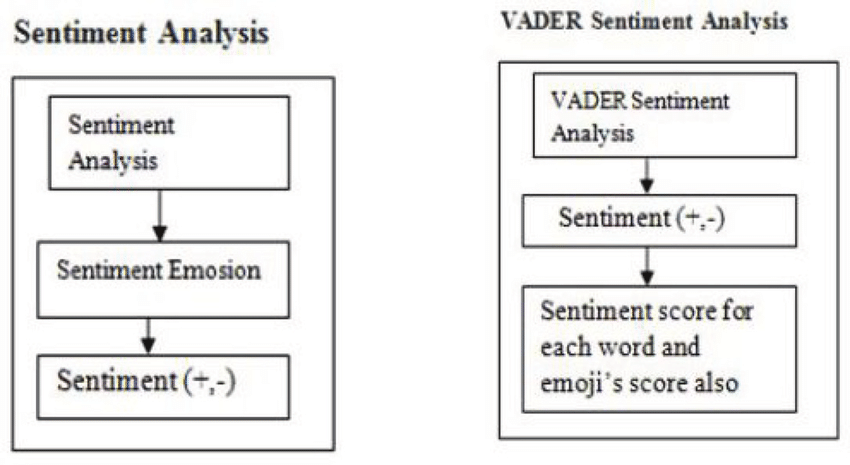
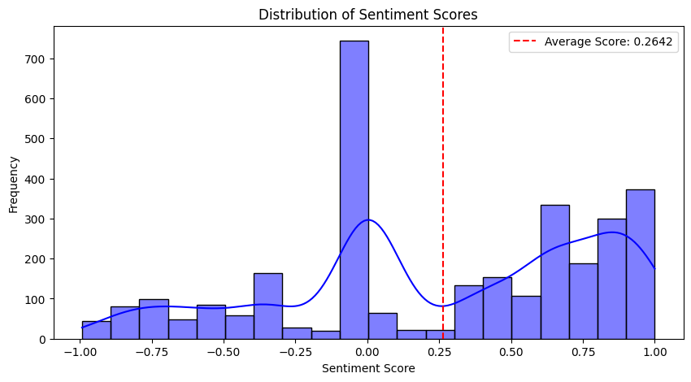
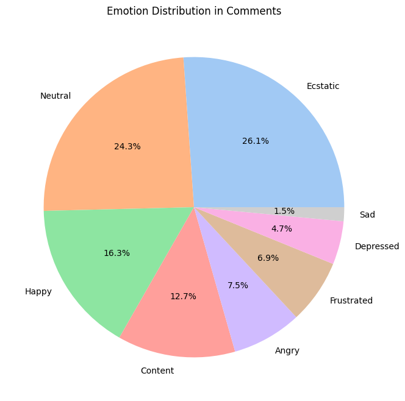

<h1 align="center"> Sentiment Analysis on YouTube Shorts NIT KURUKSHETRA project </h1>

 YouTube does not directly provide content creators with a built-in sentiment analysis graph showing viewers' sentiment towards their videos on the platform.However, understanding audience sentiment is crucial for creators to improve their content, engage with their community, and tailor their videos based on viewer feedback. By analyzing viewer comments, we aim to offer creators a comprehensive sentiment report, helping them gain deeper insights into audience reactions and trends over time. This feedback mechanism will empower creators to make data-driven decisions, refine their content strategies, and enhance viewer satisfaction. 

Key points :

- Scrapping data using the YouTube Data API and storing it in `comments.csv` file
- Using the `comments.csv` to train the SENTIMENT ANALYSIS model.
- Using the `VADER (Valence Aware Dictionary and Sentiment Reasoner)` for getting the Sentiment Analysis report.

<h2>📁 File structure</h2>
<pre>
PROJECT_FILE
│── .env                      # Environment variables (API keys, credentials)
│── Scrapper.py               # Script for scraping YouTube comments
│── comments.csv              # Scraped YouTube comments dataset
│── details.csv               # Processed data or additional details
│── sentiment.ipynb           # Jupyter Notebook for sentiment analysis
│── sentiment_analysis.csv    # Output file with sentiment analysis results
│── config.env                # Configuration settings
</pre>

